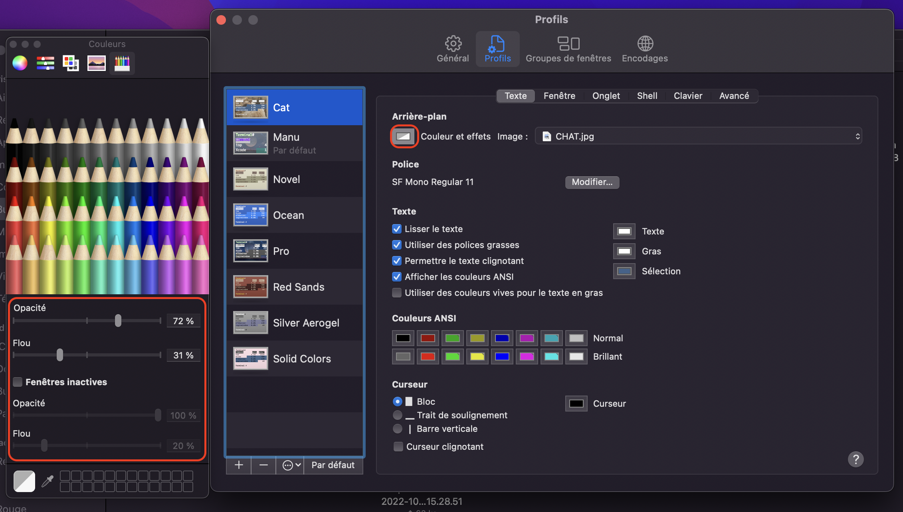

# Apple Term in color :

## 1 . ls in color:

```bash
echo "export CLICOLOR=1\n alias ls='ls -G'\n alias ll='ls -lG'" >> ~/.zshrc
source ~/.zshrc
```
Now you can try a ls or ll (for ls -l).

## 2. Enable color in vim:

```bash
echo "syntax on" >> ~/.vimrc
```
Now you should now have colors in vim.

## 3. Apple Terminal Settings:

### 3.1 Create new profile

Go to **Terminal>Settings>Profiles**, after that you will see a list of default profiles. Choose the best profile for you (Personally I take the ``Pro``), and click on the **+** to make a copy. After that, rename the copy.

### 3.2 Background Settings:


### 3.3 Opacity :



## 4. One of my themes 

If you want, you can just download and import one of my personal profiles, there are in [profile](profile/)

### 4.1 How to import/export profile :

